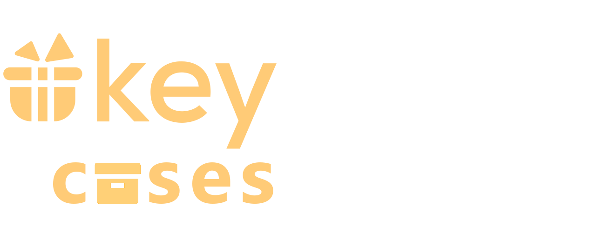

<div align="center">
  <a href="https://GitHub.com/Juzlus/KeydropPlusCasesOdds/releases/"></a>&nbsp;&nbsp;&nbsp;&nbsp;&nbsp;&nbsp;
  <a href="https://GitHub.com/Juzlus/KeydropPlusCasesOdds/commit/"></a>&nbsp;&nbsp;&nbsp;&nbsp;&nbsp;&nbsp;
</div>

# 🤔 About

Keydrop+ Cases Odds is a service that gets case odds from [keydrop.com](https://key-drop.com/).
Designed as a supporting service for [KeydropPlus v2](https://github.com/Juzlus/KeydropPlus/).


## 🌍 Available languages

- English


## 💡 Packages needed
```bash
npm i node-fetch@2  @octokit/rest  dotenv  node-cron  puppeteer  puppeteer-extra  puppeteer-extra-plugin-stealth
```


## 🛠️ Configuration
Configuration variables can be found in the file: "**.env**".

- **BROWSER_PATH** - path to the selected browser (on most OS can be left empty) 
- **BROWSER_TIMEOUT** - maximum time to wait for a response (default 160000)

In case you do not want to update the file on github, leave the **GITHUB_TOKEN** variable empty.

- **GITHUB_TOKEN** - [Create a token](https://github.com/settings/tokens)
- **GITHUB_OWNER** - user name
- **GITHUB_REPO** - repository name
- **GITHUB_FILE** - path to case odds file (e.g. data/cases.json)
- **GITHUB_BRANCH** - branch name (e.g. main)

## ✨ Usage
- [node.js](https://nodejs.org/en)
- [Keydrop API](https://key-drop.com/en/)
- [node-fetch](https://github.com/node-fetch/node-fetch)
- [@octokit/rest](https://github.com/octokit/rest.js)
- [dotenv](https://github.com/motdotla/dotenv)
- [node-cron](https://github.com/node-cron/node-cron)
- [puppeteer](https://github.com/puppeteer/puppeteer)
- [puppeteer-extra](https://github.com/berstend/puppeteer-extra)
- [puppeteer-extra-plugin-stealth](https://github.com/berstend/puppeteer-extra/tree/master/packages/puppeteer-extra-plugin-stealth)

## 🌐 Preview JSON format
```json
[
    # Youtuber cases format
    {
        "name": "ZONY",
        "img": "https://key-drop.com/uploads/skins/ZONY.png",
        "url": "https://key-drop.com/pl/panel/profil/deposit-money",
        "price_USD": 9,
        "youtuber": true,
        "odds": 15
    },
    {
        "name": "FOREVER",
        "img": "https://key-drop.com/uploads/skins/FOREVER.png",
        "url": "https://key-drop.com/pl/panel/profil/deposit-money",
        "price_USD": 9,
        "youtuber": true,
        "odds": 15
    },
    ,
    ,
    ,
    # Game/Skin cases format
    {
        "name": "Sweety",
        "odds": 15
    },
    {
        "name": "Delicious",
        "odds": 15
    },
    ,
    ,
    ,
    # Golden cases format
    {
        "name": "TOPAZ",
        "goldProfit": "13425095.27"
    },
    {
        "name": "BONY",
        "goldProfit": "12678431.26"
    }
]
```

## 🔥 Screenshots


## 📝 Feedback

If you have any Feedback or questions, please contact me at juzlus.biznes@gmail.com or [Discord](https://discordapp.com/users/284780352042434570).


## 💝 Donate
<span>
  <a href="https://www.buymeacoffee.com/juzlus" target="_blank" alt="buymeacoffee" style="width: 40%; text-decoration: none; margin-right: 20px;">
    
  </a>
  <a>⠀</a>
  <a href="https://buycoffee.to/juzlus" target="_blank" alt="buycoffee" style="text-decoration: none; width: 40%; background-color: rgb(0, 169, 98);border-radius: 10px;">
    
  </a>
</span>


## ⚠️ Disclaimer

_The KeydropPlusCasesOdds is an independent project developed by an individual and is not endorsed or affiliated with [key-drop.com](https://key-drop.com/)._

_The author of the extension is not responsible for any consequences resulting from its use._

